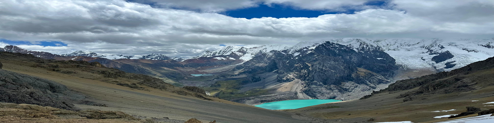

  

<h1 align="center">Hey there! I'm Luis Bautista 👋</h1>

  📊 Statistician | 🤖 Data Science & Machine Learning Enthusiast

---

### 🧠 Skills

---

### 🚀 About Me

🎓 I'm a **Statistician** with a deep passion for data analysis, data science, and machine learning.  
📚 I'm a lifelong learner who enjoys applying statistical models and machine learning to real-world problems.  
🧪 I love experimenting with new techniques, creating impactful data visualizations, and building solutions with purpose.  
🌍 I aim to develop projects that support data-driven decision-making.

---

### 📈 Areas of Interest

🔎 Data Analysis and Applied Statistics  
📉 Predictive Modeling and Machine Learning  
🌐 Data Visualization and Storytelling  
🧠 Data-Driven Decision Making  
📊 Statistical Simulations and Advanced Modeling  

---

### 💡 Projects I've Worked On

📱 Flask-based application to predict plant species.  
🤖 Customer churn prediction model for a telecommunications company  
📊 Educational dashboard in Power BI for tracking school performance  
📱 FastAPI-based application to predict customer default.  
🧪 Statistical simulations in Python and R for academic research  
🌄 Personal visualizations of hiking and mountain data with GPS integration  

---

### ✨ Personal Interests

🏍️ Traveling long distances on my motorcycle  
🥾 Trekking through trails and remote landscapes  
🧗‍♂️ Climbing mountains and snowy peaks  
🚴‍♂️ Riding my bicycle through the city and countryside  
🏋️‍♂️ Staying active at the gym and working on my fitness

Adventure, discipline, and freedom are values I live by—whether on a mountain trail or in the world of data.

---

### 🌍 Let's Connect

📬 **Email:** [lbautistab@pucp.edu.pe](mailto:lbautistab@pucp.edu.pe)  
💻 **GitHub:** [github.com/lbautistab](https://github.com/lbautistab)  
📸 **Instagram:** [@cholitoaventurero](https://www.instagram.com/cholitoaventurero)  
🎵 **TikTok:** [@cholitomotero](https://www.tiktok.com/@cholitomotero)

---

  Thanks for stopping by 🙌 Always open to new collaborations and challenges!

